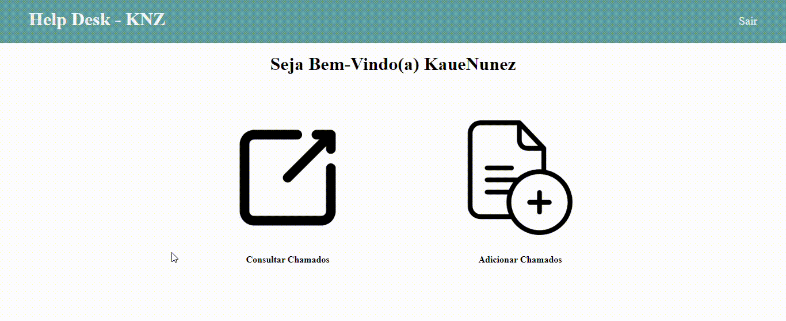

    <h1 style='text-align:center;'>HelpDesk - KNZ</h1>
    

A primeira versão do projeto Help Desk é um sistema de chamados que contém telas de login/registro, página inicial, abertura de chamados e consulta deles. Pretendo criar novas versões do Help Desk e melhorá-lo da melhor maneira possível.

<h2>Tela de Login e Registro</h2>

<h2>Tela Home</h2>

<h2>Tela Chamados</h2>
<h1>KaueNunez-05/01/2024</h1>

